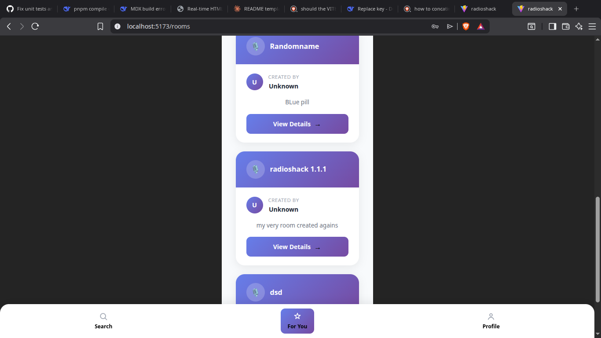
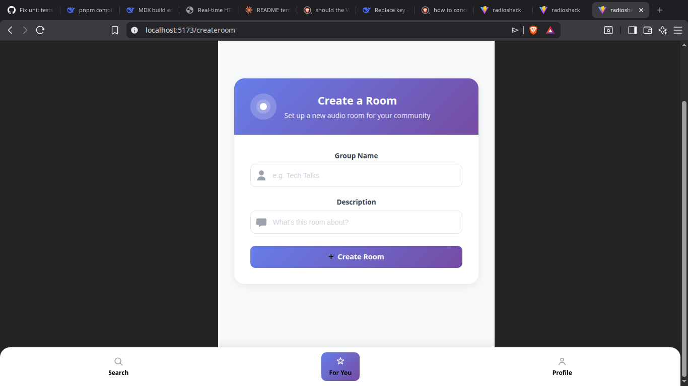
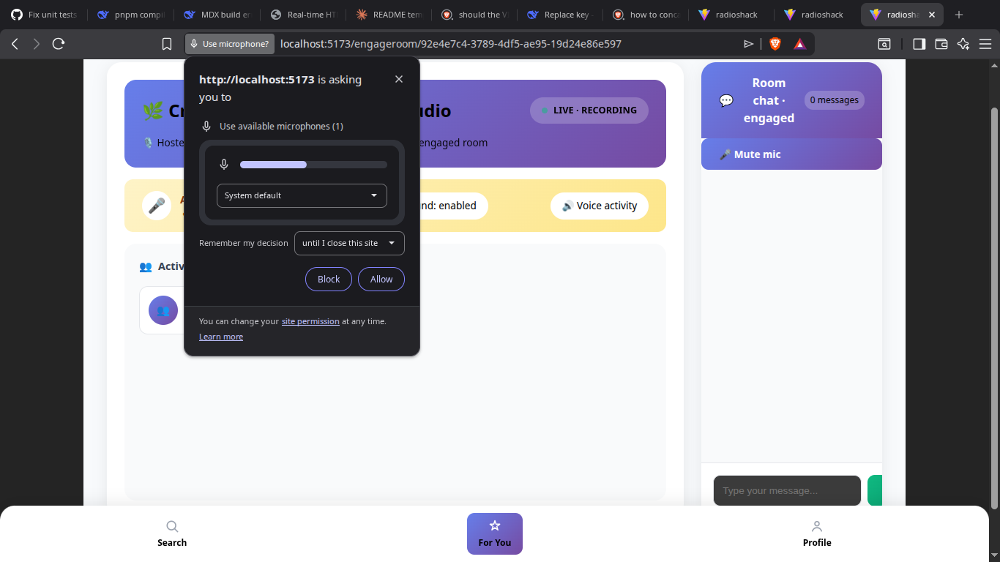
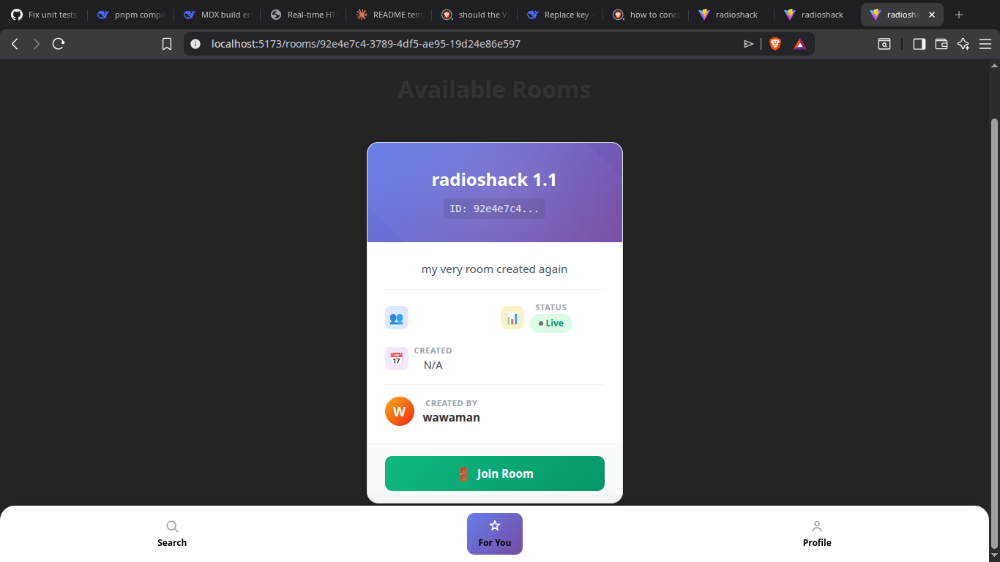
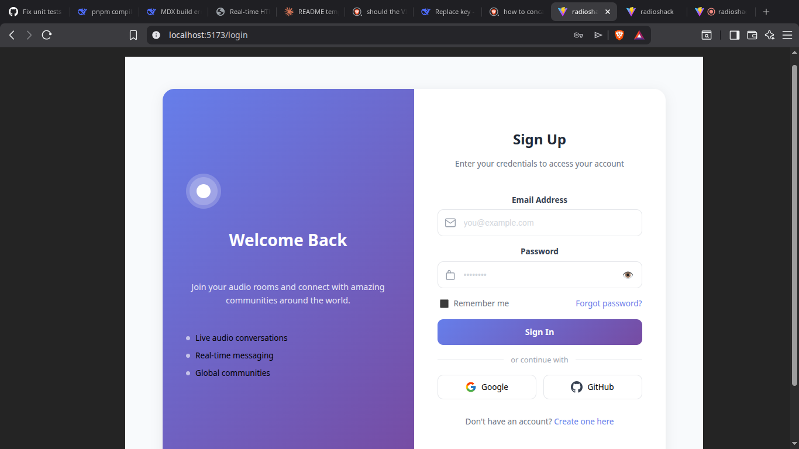
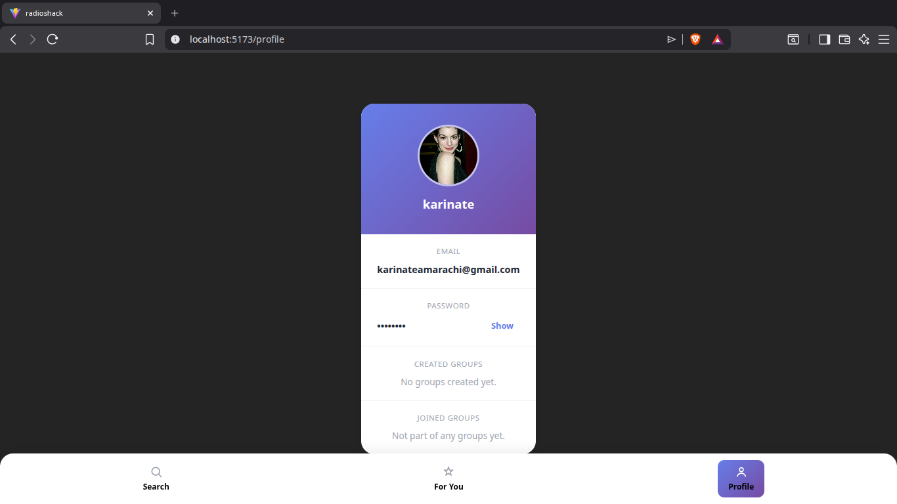
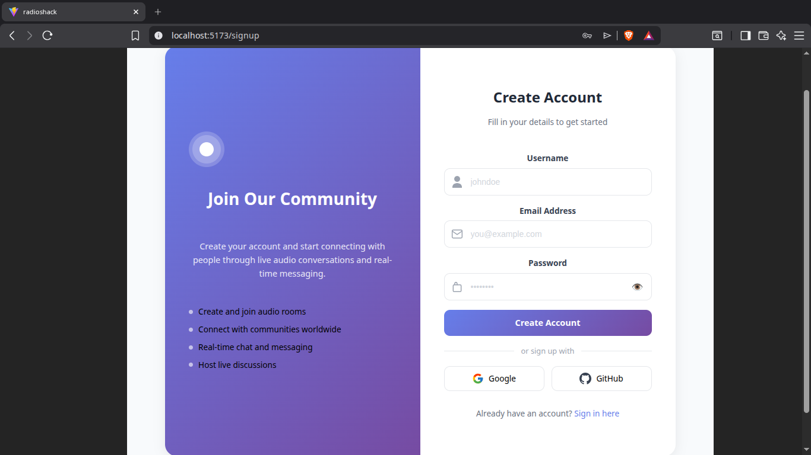

# RadioShack

RadioShack is a real-time audio room application (Clubhouse-style) built with React, TypeScript, and Vite. Users can create audio rooms, join existing rooms, and engage in live conversations.

## Table of Contents

- [Project Structure](#project-structure)
- [Components](#components)
- [Environment Variables](#environment-variables)
- [Getting Started](#getting-started)
- [License](#license)

## Project Structure

```
radioshack/
├── public/                     # Static assets served as-is
├── src/
│   ├── assets/                 # Images, icons, fonts, and other static assets
│   ├── components/              # All reusable and page-level React components
│   │   ├── audiorooms/          # Displays list/grid of available audio rooms
│   │   ├── bottomnavbar/        # Bottom navigation bar for mobile-style navigation
│   │   ├── create-audioroom/    # Form/flow for creating a new audio room
│   │   ├── engageroom/          # Active room UI (speakers, listeners, controls)
│   │   ├── joinroom/            # Flow for joining an existing audio room
│   │   ├── login/               # User login/authentication screen
│   │   ├── profile/             # User profile view and edit screen
│   │   ├── search/               # Search UI for rooms/users
│   │   └── signup/               # User registration screen
│   ├── shared/                  # Shared/common components used across features
│   ├── util/                    # Utility/helper functions
│   ├── App.css                  # Global app-level styles
│   ├── App.tsx                  # Root application component
│   ├── index.css                # Base/global CSS
│   └── main.tsx                 # Application entry point
├── LICENSE                      # MIT License
├── README.md                    # Project documentation (this file)
├── eslint.config.js             # ESLint configuration
├── generate-react-cli.json      # Config for generate-react-cli component scaffolding
├── index.html                   # HTML entry point
├── package.json                 # Project dependencies and scripts
└── package-lock.json            # Locked dependency versions
```

## Components

Below is a breakdown of each component in `src/components/`. Add a screenshot for each by pasting an image URL in place of the placeholder link.

### AudioRooms
Displays the list/grid of currently active or available audio rooms that a user can browse and join.



### BottomNavBar
The persistent bottom navigation bar used to move between the app's main sections (e.g., Home, Search, Profile).


### Create Audio Room
The form and flow a user goes through to create and configure a new audio room (title, topic, privacy settings, etc.).



### Engage Room
The core "in-room" experience — shows speakers, listeners, mic controls, and other live-room interactions.



### Join Room
Handles the flow for a user joining an existing audio room, including any pre-join checks or prompts.



### Login
Authentication screen where existing users sign in to their account.



### Profile
Displays and allows editing of the current user's profile information.



### Search
Provides search functionality for finding rooms, topics, or other users.


### Signup
Registration screen for new users to create an account.



### Shared
Common, reusable UI pieces (buttons, modals, inputs, etc.) shared across multiple components.


## Environment Variables

Create a `.env` file in the project root with the following variables. Adjust names/values to match your actual backend, auth, and media providers.

```env
# API

VITE_WSURL = "useyour livekit server url"
VITE_BEURL =https://radioshack-be.vercel.app

```

> **Note:** Never commit your `.env` file. Ensure it is listed in `.gitignore`.

## Getting Started

```bash
# Install dependencies
npm install

# Start the development server
npm run dev

# Build for production
npm run build
```

## License

This project is licensed under the **MIT License** — see the [LICENSE](./LICENSE) file for details.
